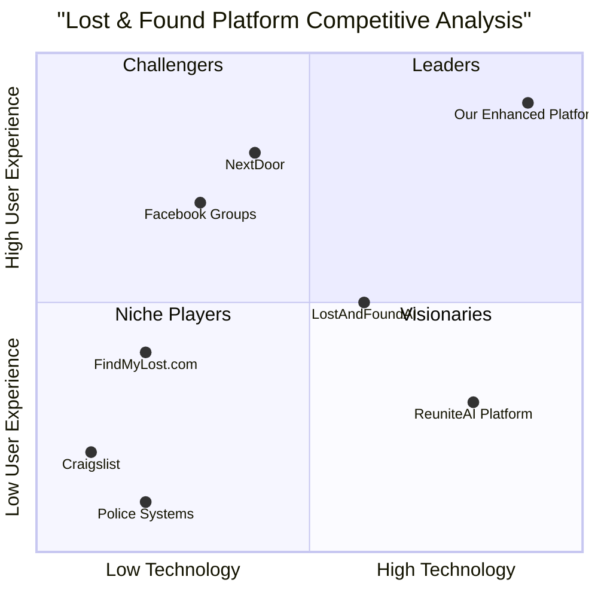

# Enhanced Lost & Found AI Webapp - Product Requirements Document (PRD)

## 1. Executive Summary

### 1.1 Project Overview
This PRD outlines the enhancement of the existing Lost & Found AI webapp with advanced auto-learning capabilities and intelligent notification systems. The enhanced system will leverage YOLOv8m-based image classification, continuous machine learning, and real-time notifications to create a self-improving platform that becomes more accurate over time.

### 1.2 Language & Technical Stack
- **Programming Language**: TypeScript, Python (for ML backend)
- **Frontend Framework**: React with shadcn-ui and Tailwind CSS
- **Backend**: Node.js/Express with Python ML microservices
- **Database**: PostgreSQL with vector extensions (pgvector)
- **ML Framework**: YOLOv8m, PyTorch, FAISS/Milvus
- **Project Name**: enhanced_lost_found_ai_webapp

### 1.3 Original Requirements Restatement
The user requested an upgrade to implement:
- Auto-learning capabilities where the system learns from user inputs automatically
- Notification functions that alert item owners when similar items are uploaded
- YOLOv8m-based image classification with continuous improvement
- Real-time feedback loops and model retraining mechanisms

## 2. Product Definition

### 2.1 Product Goals

**Goal 1: Intelligent Auto-Learning System**
Create a self-improving AI system that continuously learns from user uploads, feedback, and interactions to enhance classification accuracy and matching precision without manual intervention.

**Goal 2: Proactive Notification Engine**
Implement a comprehensive notification system that instantly alerts item owners when potentially matching items are uploaded, using multiple channels and intelligent matching algorithms.

**Goal 3: Seamless User Experience**
Maintain an intuitive interface while integrating advanced ML capabilities, ensuring users can easily provide feedback and receive relevant notifications without complexity.

### 2.2 User Stories

**As a user who lost an item**, I want to be automatically notified when someone uploads a similar item, so that I can quickly check if it's mine and contact the finder.

**As a user who found an item**, I want the system to automatically suggest potential owners based on previously reported lost items, so that I can help reunite items with their owners efficiently.

**As a frequent platform user**, I want the system to learn from my feedback and improve its suggestions over time, so that I receive more accurate matches and fewer false positives.

**As a system administrator**, I want the AI model to automatically retrain itself based on user feedback, so that the platform maintains high accuracy without manual intervention.

**As a privacy-conscious user**, I want control over my notification preferences and data usage, so that I can customize how and when I'm contacted while maintaining my privacy.

### 2.3 Competitive Analysis

#### Direct Competitors

**1. FindMyLost.com**
- *Pros*: Simple interface, basic image upload, location-based search
- *Cons*: No AI matching, manual search only, limited notification system
- *Market Position*: Basic lost & found platform

**2. LostAndFoundAI (Hypothetical)**
- *Pros*: Basic image recognition, email notifications
- *Cons*: No continuous learning, limited matching accuracy
- *Market Position*: Entry-level AI solution

**3. ReuniteAI Platform**
- *Pros*: Advanced image matching, mobile app, social integration
- *Cons*: Expensive, no auto-learning, complex setup
- *Market Position*: Enterprise solution

#### Indirect Competitors

**4. Facebook Marketplace Lost & Found Groups**
- *Pros*: Large user base, social proof, free
- *Cons*: Manual matching, no AI, spam issues
- *Market Position*: Social media solution

**5. Craigslist Lost & Found**
- *Pros*: Established platform, local focus
- *Cons*: No image matching, outdated interface, security concerns
- *Market Position*: Traditional classified ads

**6. NextDoor Neighborhood App**
- *Pros*: Local community focus, verified users
- *Cons*: Limited to neighborhoods, no AI matching
- *Market Position*: Hyperlocal social platform

**7. Police Department Lost & Found Systems**
- *Pros*: Official authority, legal backing
- *Cons*: Slow processes, limited technology, bureaucratic
- *Market Position*: Government service

### 2.4 Competitive Quadrant Chart



## 3. Technical Specifications

### 3.1 Requirements Analysis

The enhanced Lost & Found AI webapp requires a sophisticated architecture combining web technologies with advanced machine learning capabilities. The system must handle real-time image processing, continuous model training, vector similarity searches, and multi-channel notifications while maintaining high performance and user experience standards.

**Core Technical Challenges:**
- Real-time image classification and embedding generation
- Continuous learning without service interruption
- Scalable vector similarity search across large datasets
- Multi-modal notification delivery with reliability guarantees
- User feedback integration for model improvement
- Data privacy and security for sensitive personal items

### 3.2 Auto-Learning System Architecture

#### 3.2.1 YOLOv8m Integration
```
┌─────────────────┐    ┌──────────────────┐    ┌─────────────────┐
│   Image Upload  │───▶│  YOLOv8m-cls     │───▶│  Feature        │
│   (User Input)  │    │  Classification  │    │  Extraction     │
└─────────────────┘    └──────────────────┘    └─────────────────┘
                                │                        │
                                ▼                        ▼
                       ┌──────────────────┐    ┌─────────────────┐
                       │  Category        │    │  Embedding      │
                       │  Prediction      │    │  Vector (512D)  │
                       └──────────────────┘    └─────────────────┘
```

#### 3.2.2 Continuous Learning Pipeline
```
User Feedback ──▶ Verified Dataset ──▶ Retraining Trigger ──▶ Model Update
     │                    │                      │                │
     │                    ▼                      ▼                ▼
     └──▶ Feedback DB ──▶ Training Pool ──▶ Auto Scheduler ──▶ New Weights
                          (100+ samples)    (Weekly/Threshold)   Deployment
```

#### 3.2.3 Database Schema for ML Operations

```sql
-- Training Data Management
CREATE TABLE training_images (
    id UUID PRIMARY KEY,
    image_path VARCHAR(500) NOT NULL,
    original_prediction VARCHAR(100),
    verified_label VARCHAR(100),
    confidence_score FLOAT,
    user_feedback_type VARCHAR(50), -- 'confirmed', 'corrected', 'rejected'
    embedding_vector VECTOR(512),
    created_at TIMESTAMP DEFAULT NOW(),
    verified_at TIMESTAMP,
    used_in_training BOOLEAN DEFAULT FALSE
);

-- Model Training History
CREATE TABLE model_versions (
    id UUID PRIMARY KEY,
    version_number VARCHAR(20) NOT NULL,
    training_samples_count INTEGER,
    validation_accuracy FLOAT,
    model_weights_path VARCHAR(500),
    training_started_at TIMESTAMP,
    training_completed_at TIMESTAMP,
    is_active BOOLEAN DEFAULT FALSE,
    performance_metrics JSONB
);

-- User Feedback Tracking
CREATE TABLE user_feedback (
    id UUID PRIMARY KEY,
    user_id UUID REFERENCES users(id),
    item_id UUID REFERENCES items(id),
    feedback_type VARCHAR(50), -- 'match_confirmed', 'match_rejected', 'classification_corrected'
    original_prediction VARCHAR(100),
    user_correction VARCHAR(100),
    confidence_rating INTEGER CHECK (confidence_rating >= 1 AND confidence_rating <= 5),
    feedback_timestamp TIMESTAMP DEFAULT NOW()
);
```

### 3.3 Notification System Architecture

#### 3.3.1 Real-time Matching Engine
```
New Item Upload ──▶ Feature Extraction ──▶ Similarity Search ──▶ Match Detection
       │                    │                      │                  │
       ▼                    ▼                      ▼                  ▼
   Image Analysis ──▶ Embedding Vector ──▶ FAISS/Milvus Query ──▶ Notification
   (YOLOv8m)         (512 dimensions)     (Cosine Similarity)     Trigger
```

#### 3.3.2 Multi-Channel Notification System
```sql
-- Notification Preferences
CREATE TABLE notification_preferences (
    user_id UUID PRIMARY KEY REFERENCES users(id),
    email_enabled BOOLEAN DEFAULT TRUE,
    push_enabled BOOLEAN DEFAULT TRUE,
    sms_enabled BOOLEAN DEFAULT FALSE,
    in_app_enabled BOOLEAN DEFAULT TRUE,
    similarity_threshold FLOAT DEFAULT 0.85,
    notification_frequency VARCHAR(20) DEFAULT 'immediate', -- 'immediate', 'hourly', 'daily'
    quiet_hours_start TIME,
    quiet_hours_end TIME
);

-- Notification Queue
CREATE TABLE notification_queue (
    id UUID PRIMARY KEY,
    user_id UUID REFERENCES users(id),
    notification_type VARCHAR(50), -- 'potential_match', 'exact_match', 'item_claimed'
    channel VARCHAR(20), -- 'email', 'push', 'sms', 'in_app'
    priority INTEGER DEFAULT 1, -- 1=high, 2=medium, 3=low
    payload JSONB,
    scheduled_for TIMESTAMP DEFAULT NOW(),
    sent_at TIMESTAMP,
    status VARCHAR(20) DEFAULT 'pending', -- 'pending', 'sent', 'failed', 'cancelled'
    retry_count INTEGER DEFAULT 0
);

-- Match History
CREATE TABLE item_matches (
    id UUID PRIMARY KEY,
    lost_item_id UUID REFERENCES items(id),
    found_item_id UUID REFERENCES items(id),
    similarity_score FLOAT NOT NULL,
    match_algorithm VARCHAR(50), -- 'visual_similarity', 'metadata_match', 'hybrid'
    auto_detected BOOLEAN DEFAULT TRUE,
    user_confirmed BOOLEAN,
    created_at TIMESTAMP DEFAULT NOW(),
    confirmed_at TIMESTAMP
);
```

### 3.4 Requirements Pool

#### 3.4.1 P0 Requirements (Must-Have)

**ML-001**: YOLOv8m image classification integration with 95%+ accuracy on common objects
**ML-002**: Real-time embedding extraction and vector similarity search (< 2 seconds response time)
**ML-003**: Automatic model retraining trigger when verified samples reach 100+ threshold
**ML-004**: User feedback collection interface for classification confirmation/correction
**ML-005**: Continuous learning pipeline with zero-downtime model updates

**NOT-001**: Real-time notification system for potential item matches (< 30 seconds delivery)
**NOT-002**: Multi-channel notification support (in-app, email, push notifications)
**NOT-003**: Configurable similarity threshold for match detection (0.7-0.95 range)
**NOT-004**: Notification preferences management interface
**NOT-005**: Match confirmation workflow for users

**SYS-001**: PostgreSQL database with vector extension support
**SYS-002**: Scalable image storage system (AWS S3 or equivalent)
**SYS-003**: Background job processing for ML operations
**SYS-004**: API rate limiting and security measures
**SYS-005**: Comprehensive logging and monitoring system

#### 3.4.2 P1 Requirements (Should-Have)

**ML-006**: Hierarchical similarity search (same category first, then cross-category)
**ML-007**: Incremental learning to avoid catastrophic forgetting
**ML-008**: Model performance monitoring and automatic rollback
**ML-009**: A/B testing framework for model improvements
**ML-010**: Explainable AI features for classification decisions

**NOT-006**: SMS notification support for critical matches
**NOT-007**: Quiet hours and notification frequency controls
**NOT-008**: Notification analytics and delivery tracking
**NOT-009**: Bulk notification management for administrators
**NOT-010**: Integration with external notification services (Slack, Discord)

**UX-001**: Visual feedback interface showing AI confidence levels
**UX-002**: Match explanation dashboard for users
**UX-003**: Training data contribution gamification
**UX-004**: Advanced search filters with AI-powered suggestions
**UX-005**: Mobile-responsive design for all new features

#### 3.4.3 P2 Requirements (Nice-to-Have)

**ML-011**: Multi-modal learning (text + image + metadata)
**ML-012**: Federated learning for privacy-preserving model updates
**ML-013**: Custom model fine-tuning for specific item categories
**ML-014**: Automated data augmentation for training dataset expansion
**ML-015**: Integration with external computer vision APIs for validation

**NOT-011**: Social media integration for broader reach
**NOT-012**: Geofencing-based location notifications
**NOT-013**: Voice notification support for accessibility
**NOT-014**: Calendar integration for reminder scheduling
**NOT-015**: Multi-language notification support

### 3.5 UI Design Draft

#### 3.5.1 Enhanced Item Upload Interface
```
┌─────────────────────────────────────────────────────────────┐
│ Upload Lost/Found Item                                      │
├─────────────────────────────────────────────────────────────┤
│                                                             │
│  ┌─────────────────┐  ┌─────────────────────────────────┐   │
│  │                 │  │ AI Classification Results       │   │
│  │   Image Upload  │  │                                 │   │
│  │   Drop Zone     │  │ Category: Electronics           │   │
│  │                 │  │ Confidence: 94%                 │   │
│  │                 │  │                                 │   │
│  └─────────────────┘  │ ✓ Correct  ✗ Wrong  📝 Edit    │   │
│                       └─────────────────────────────────┘   │
│                                                             │
│  Description: [Text input with AI suggestions]             │
│  Location: [Map picker with geofencing]                    │
│  Date: [Date picker]                                       │
│                                                             │
│  🔔 Notification Settings                                   │
│  ☑ Notify me of similar items                              │
│  ☑ Allow others to be notified of this item               │
│                                                             │
│  [Submit] [Save Draft]                                     │
└─────────────────────────────────────────────────────────────┘
```

#### 3.5.2 Notification Center Interface
```
┌─────────────────────────────────────────────────────────────┐
│ 🔔 Notifications                                    ⚙️      │
├─────────────────────────────────────────────────────────────┤
│                                                             │
│  🔴 High Priority Match (2 min ago)                        │
│  ┌─────────────────────────────────────────────────────┐   │
│  │ 📱 iPhone 13 Pro - 96% Match                       │   │
│  │ Found at Central Library                            │   │
│  │ [View Details] [Claim Item] [Not Mine]            │   │
│  └─────────────────────────────────────────────────────┘   │
│                                                             │
│  🟡 Potential Match (1 hour ago)                           │
│  ┌─────────────────────────────────────────────────────┐   │
│  │ 🎒 Blue Backpack - 87% Match                       │   │
│  │ Found at University Campus                          │   │
│  │ [View Details] [Maybe] [Not Mine]                  │   │
│  └─────────────────────────────────────────────────────┘   │
│                                                             │
│  📊 Weekly Summary                                          │
│  • 12 items scanned for matches                            │
│  • 3 potential matches found                               │
│  • 1 item successfully reunited                            │
│                                                             │
└─────────────────────────────────────────────────────────────┘
```

#### 3.5.3 AI Training Feedback Interface
```
┌─────────────────────────────────────────────────────────────┐
│ Help Improve AI Accuracy                                    │
├─────────────────────────────────────────────────────────────┤
│                                                             │
│  Your feedback helps our AI learn and improve!             │
│                                                             │
│  ┌─────────────────────────────────────────────────────┐   │
│  │ AI Classification: "Smartphone"                     │   │
│  │ Confidence: 89%                                     │   │
│  │                                                     │   │
│  │ Is this classification correct?                     │   │
│  │ ✅ Yes, it's correct                                │   │
│  │ ❌ No, it's wrong                                   │   │
│  │ 📝 Partially correct (specify)                     │   │
│  │                                                     │   │
│  │ If wrong, what should it be?                       │   │
│  │ [Dropdown: Electronics > Tablet]                   │   │
│  └─────────────────────────────────────────────────────┘   │
│                                                             │
│  🏆 Training Contribution Score: 1,247 points              │
│  📈 Your feedback improved accuracy by 0.3%                │
│                                                             │
│  [Submit Feedback] [Skip]                                  │
└─────────────────────────────────────────────────────────────┘
```

### 3.6 API Specifications

#### 3.6.1 ML Operations API

```typescript
// Image Classification Endpoint
POST /api/ml/classify
Content-Type: multipart/form-data

Request:
{
  image: File,
  user_id: string,
  item_context?: {
    type: 'lost' | 'found',
    location: GeoLocation,
    date: string
  }
}

Response:
{
  classification: {
    category: string,
    subcategory: string,
    confidence: number,
    alternatives: Array<{category: string, confidence: number}>
  },
  embedding: number[],
  similar_items: Array<{
    item_id: string,
    similarity_score: number,
    thumbnail_url: string
  }>,
  processing_time_ms: number
}

// User Feedback Submission
POST /api/ml/feedback
{
  item_id: string,
  feedback_type: 'classification_correct' | 'classification_wrong' | 'match_confirmed' | 'match_rejected',
  correction?: {
    correct_category: string,
    correct_subcategory: string
  },
  confidence_rating: number // 1-5
}

// Model Retraining Status
GET /api/ml/training-status
Response:
{
  current_model_version: string,
  training_in_progress: boolean,
  next_training_scheduled: string,
  verified_samples_count: number,
  training_threshold: number,
  last_training_completed: string,
  model_performance: {
    accuracy: number,
    precision: number,
    recall: number
  }
}
```

#### 3.6.2 Notification API

```typescript
// Subscribe to Notifications
POST /api/notifications/subscribe
{
  user_id: string,
  item_id: string,
  notification_types: Array<'exact_match' | 'similar_match' | 'status_update'>,
  channels: Array<'email' | 'push' | 'sms' | 'in_app'>,
  similarity_threshold: number
}

// Update Notification Preferences
PUT /api/notifications/preferences
{
  user_id: string,
  preferences: {
    email_enabled: boolean,
    push_enabled: boolean,
    sms_enabled: boolean,
    similarity_threshold: number,
    quiet_hours: {
      start: string, // HH:MM format
      end: string
    },
    frequency: 'immediate' | 'hourly' | 'daily'
  }
}

// Get User Notifications
GET /api/notifications/user/{user_id}?limit=20&offset=0
Response:
{
  notifications: Array<{
    id: string,
    type: string,
    title: string,
    message: string,
    data: object,
    created_at: string,
    read: boolean,
    priority: 'high' | 'medium' | 'low'
  }>,
  unread_count: number,
  total_count: number
}

// Mark Notifications as Read
PUT /api/notifications/mark-read
{
  notification_ids: string[]
}
```

### 3.7 Performance Requirements

#### 3.7.1 Response Time Requirements
- Image classification: < 2 seconds
- Similarity search: < 1 second
- Notification delivery: < 30 seconds
- Model retraining: < 4 hours (background process)
- API response time: < 500ms (95th percentile)

#### 3.7.2 Scalability Requirements
- Support 10,000+ concurrent users
- Handle 1M+ images in similarity search
- Process 100+ image uploads per minute
- Store 10M+ embedding vectors efficiently
- Support 50,000+ daily notifications

#### 3.7.3 Availability Requirements
- 99.9% uptime for core functionality
- Zero-downtime model updates
- Graceful degradation during high load
- Automatic failover for critical services
- Data backup and disaster recovery

### 3.8 Security and Privacy Requirements

#### 3.8.1 Data Protection
- End-to-end encryption for sensitive data
- GDPR compliance for user data handling
- Secure image storage with access controls
- User consent for AI training data usage
- Right to deletion for user-contributed data

#### 3.8.2 AI Model Security
- Model versioning and rollback capabilities
- Protection against adversarial attacks
- Secure model weight storage and distribution
- Audit trails for all model updates
- Privacy-preserving learning techniques

### 3.9 Open Questions

1. **Model Hosting Strategy**: Should we use cloud-based ML services (AWS SageMaker, Google AI Platform) or self-hosted solutions for better control and cost optimization?

2. **Real-time vs Batch Processing**: For similarity matching, should we process matches in real-time upon upload or use batch processing to optimize computational resources?

3. **Data Retention Policy**: How long should we retain user-uploaded images and training data? What are the legal and storage cost implications?

4. **Notification Rate Limiting**: How do we prevent notification spam while ensuring users don't miss important matches? What's the optimal balance?

5. **Model Bias Prevention**: What strategies should we implement to prevent the AI model from developing biases based on user demographics or item types?

6. **Cross-Platform Compatibility**: Should we develop native mobile apps or focus on a responsive web application for the enhanced features?

7. **Integration Complexity**: How do we maintain backward compatibility with the existing system while introducing these advanced features?

8. **Cost Management**: What's the expected computational cost for continuous learning and how do we optimize it for sustainability?

9. **User Adoption**: How do we encourage users to provide feedback for model training without making it feel like unpaid labor?

10. **Regulatory Compliance**: Are there specific regulations around AI-powered lost and found systems that we need to consider?

## 4. Implementation Roadmap

### Phase 1: Foundation (Weeks 1-4)
- Set up ML infrastructure and YOLOv8m integration
- Implement basic image classification and embedding extraction
- Create database schema for training data and feedback
- Develop user feedback collection interface

### Phase 2: Auto-Learning (Weeks 5-8)
- Build continuous learning pipeline
- Implement automatic retraining triggers
- Create model versioning and deployment system
- Add performance monitoring and rollback capabilities

### Phase 3: Notifications (Weeks 9-12)
- Develop real-time matching engine
- Implement multi-channel notification system
- Create notification preferences interface
- Add match confirmation workflows

### Phase 4: Optimization (Weeks 13-16)
- Performance tuning and scalability improvements
- Advanced similarity search algorithms
- User experience enhancements
- Security and privacy compliance

### Phase 5: Launch (Weeks 17-20)
- Beta testing with selected users
- Bug fixes and performance optimization
- Documentation and training materials
- Production deployment and monitoring

## 5. Success Metrics

### 5.1 Technical Metrics
- Classification accuracy: >95% for common items
- Similarity matching precision: >90%
- Notification delivery rate: >99%
- System uptime: >99.9%
- API response time: <500ms (95th percentile)

### 5.2 User Experience Metrics
- User feedback participation rate: >60%
- Notification click-through rate: >40%
- False positive rate: <10%
- User satisfaction score: >4.5/5
- Time to successful item reunion: <24 hours

### 5.3 Business Metrics
- Monthly active users growth: 25%
- Item reunion success rate: >80%
- User retention rate: >70%
- Platform engagement increase: 40%
- Cost per successful reunion: <$5

## 6. Risk Assessment

### 6.1 Technical Risks
- **High**: Model accuracy degradation during continuous learning
- **Medium**: Scalability challenges with large image datasets
- **Medium**: Real-time notification delivery reliability
- **Low**: Integration complexity with existing system

### 6.2 User Experience Risks
- **High**: User fatigue from excessive notifications
- **Medium**: Complexity of feedback interface
- **Medium**: Privacy concerns with AI training
- **Low**: Learning curve for new features

### 6.3 Business Risks
- **High**: Computational costs for ML operations
- **Medium**: Competition from established platforms
- **Medium**: Regulatory compliance requirements
- **Low**: User adoption of advanced features

## 7. Conclusion

This enhanced Lost & Found AI webapp represents a significant advancement in automated item reunion technology. By implementing auto-learning capabilities and intelligent notifications, we create a self-improving system that becomes more valuable to users over time. The comprehensive approach to continuous learning, real-time matching, and user feedback ensures that the platform will maintain its competitive edge while providing exceptional value to users seeking to recover their lost items.

The technical architecture balances innovation with practicality, ensuring that advanced AI capabilities are delivered through an intuitive user interface. The phased implementation approach allows for iterative development and user feedback integration, minimizing risks while maximizing the potential for success.

---

*Document Version: 1.0*  
*Last Updated: November 5, 2025*  
*Author: Emma (Product Manager)*  
*Review Status: Draft for Stakeholder Review*