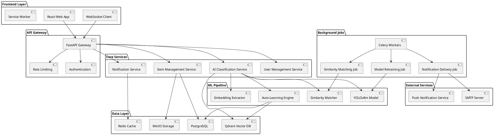
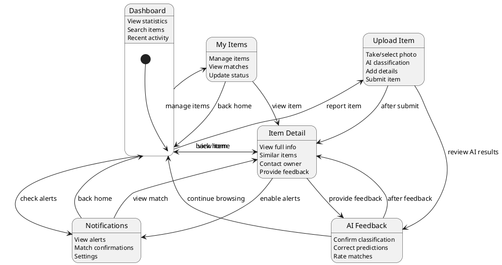
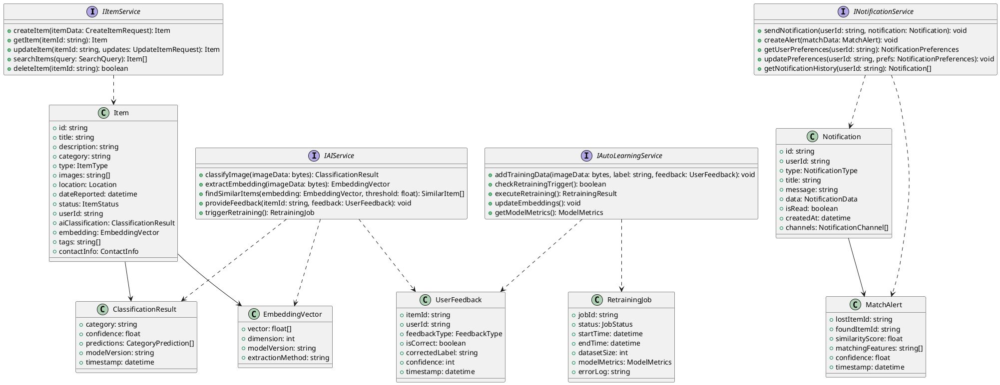
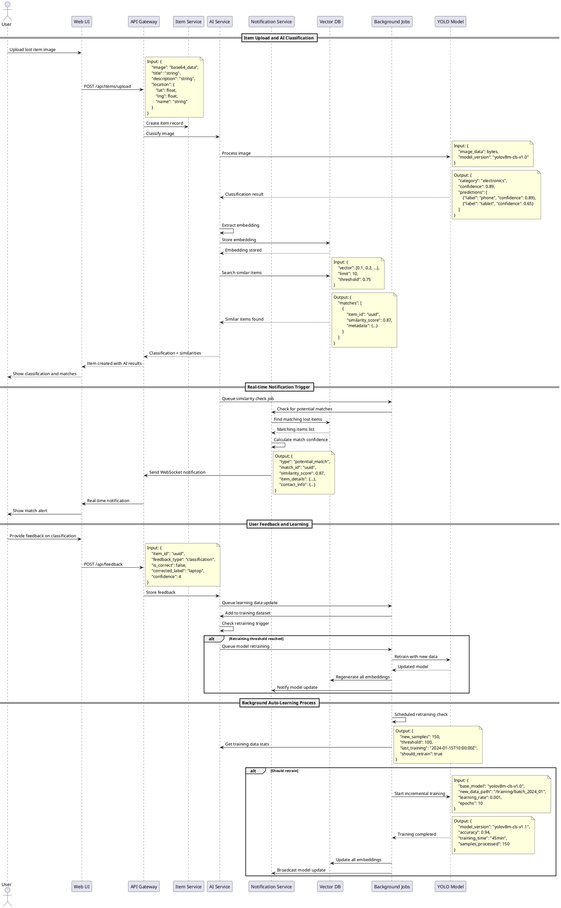

# Enhanced Lost & Found AI System Architecture

## 1. Implementation Approach

We will implement the following key enhancements to transform the current Lost & Found webapp into an intelligent, self-learning system:

### 1.1 Core Technical Challenges
- **YOLOv8m Integration**: Deploy computer vision model in web environment with efficient inference
- **Real-time Learning**: Implement continuous learning pipeline without service interruption
- **Scalable Notifications**: Design high-throughput notification system for instant matching alerts
- **Embedding Management**: Efficient storage and retrieval of high-dimensional vectors
- **Background Processing**: Robust job scheduling for model retraining and similarity matching

### 1.2 Technology Stack Selection
- **Frontend**: React 19 + TypeScript + shadcn/ui (existing)
- **Backend**: FastAPI + SQLModel + Redis + Celery
- **ML Framework**: YOLOv8 + PyTorch + ONNX Runtime
- **Vector Database**: Qdrant for embedding storage and similarity search
- **Message Queue**: Redis + Celery for background tasks
- **Notification**: WebSocket + Server-Sent Events + Email (SMTP)
- **Database**: PostgreSQL with vector extensions
- **File Storage**: MinIO/S3 for image storage
- **Monitoring**: Prometheus + Grafana

## 2. Main User-UI Interaction Patterns

### 2.1 Enhanced Upload Flow
1. **Image Upload**: User uploads lost/found item image
2. **AI Classification**: Real-time YOLOv8m classification with confidence scores
3. **Similarity Matching**: Instant similarity search against existing items
4. **Feedback Collection**: User confirms/corrects AI predictions
5. **Smart Notifications**: Automatic alerts to potential matches

### 2.2 Notification Interactions
1. **Instant Alerts**: Real-time in-app notifications for potential matches
2. **Email Notifications**: Detailed match reports with images and confidence scores
3. **Notification Center**: Centralized hub for all alerts and updates
4. **Preference Management**: Granular control over notification types and frequency

### 2.3 Learning Feedback Loop
1. **Classification Feedback**: Thumbs up/down on AI predictions
2. **Match Confirmation**: Users confirm successful item reunions
3. **Correction Interface**: Easy correction of misclassified items
4. **Learning Progress**: Visual feedback on system improvement metrics

## 3. System Architecture



## 4. UI Navigation Flow



## 5. Class Diagram



## 6. Sequence Diagram



## 7. Database ER Diagram

```plantuml
@startuml
entity "users" as users {
    * id : uuid <<PK>>
    --
    * email : varchar(255)
    * password_hash : varchar(255)
    * name : varchar(100)
    * phone : varchar(20)
    * created_at : timestamp
    * updated_at : timestamp
    * is_active : boolean
    * email_verified : boolean
}

entity "items" as items {
    * id : uuid <<PK>>
    --
    * user_id : uuid <<FK>>
    * title : varchar(200)
    * description : text
    * category : varchar(50)
    * type : enum('lost', 'found')
    * status : enum('active', 'matched', 'resolved', 'expired')
    * location_lat : decimal(10,8)
    * location_lng : decimal(11,8)
    * location_name : varchar(200)
    * date_reported : timestamp
    * date_lost_found : timestamp
    * created_at : timestamp
    * updated_at : timestamp
    * contact_phone : varchar(20)
    * contact_email : varchar(255)
    * reward_amount : decimal(10,2)
}

entity "item_images" as item_images {
    * id : uuid <<PK>>
    --
    * item_id : uuid <<FK>>
    * image_url : varchar(500)
    * image_path : varchar(500)
    * is_primary : boolean
    * file_size : bigint
    * mime_type : varchar(50)
    * created_at : timestamp
}

entity "ai_classifications" as ai_classifications {
    * id : uuid <<PK>>
    --
    * item_id : uuid <<FK>>
    * model_version : varchar(50)
    * predicted_category : varchar(50)
    * confidence_score : decimal(5,4)
    * predictions_json : jsonb
    * embedding_vector : vector(512)
    * processing_time_ms : integer
    * created_at : timestamp
}

entity "user_feedback" as user_feedback {
    * id : uuid <<PK>>
    --
    * item_id : uuid <<FK>>
    * user_id : uuid <<FK>>
    * classification_id : uuid <<FK>>
    * feedback_type : enum('classification', 'similarity', 'match')
    * is_correct : boolean
    * corrected_label : varchar(50)
    * confidence_rating : integer
    * feedback_text : text
    * created_at : timestamp
}

entity "training_dataset" as training_dataset {
    * id : uuid <<PK>>
    --
    * item_id : uuid <<FK>>
    * image_path : varchar(500)
    * verified_label : varchar(50)
    * confidence_score : decimal(5,4)
    * user_verified : boolean
    * feedback_count : integer
    * is_active : boolean
    * added_at : timestamp
    * last_used_at : timestamp
}

entity "model_versions" as model_versions {
    * id : uuid <<PK>>
    --
    * version : varchar(50)
    * model_path : varchar(500)
    * training_data_size : integer
    * accuracy_score : decimal(5,4)
    * precision_score : decimal(5,4)
    * recall_score : decimal(5,4)
    * f1_score : decimal(5,4)
    * training_duration_minutes : integer
    * is_active : boolean
    * created_at : timestamp
}

entity "similarity_matches" as similarity_matches {
    * id : uuid <<PK>>
    --
    * lost_item_id : uuid <<FK>>
    * found_item_id : uuid <<FK>>
    * similarity_score : decimal(5,4)
    * matching_features : jsonb
    * ai_confidence : decimal(5,4)
    * user_confirmed : boolean
    * status : enum('pending', 'confirmed', 'rejected', 'expired')
    * created_at : timestamp
    * confirmed_at : timestamp
}

entity "notifications" as notifications {
    * id : uuid <<PK>>
    --
    * user_id : uuid <<FK>>
    * match_id : uuid <<FK>>
    * type : enum('match_found', 'item_claimed', 'system_update')
    * title : varchar(200)
    * message : text
    * data : jsonb
    * channels : jsonb
    * is_read : boolean
    * sent_at : timestamp
    * read_at : timestamp
    * created_at : timestamp
}

entity "notification_preferences" as notification_preferences {
    * id : uuid <<PK>>
    --
    * user_id : uuid <<FK>>
    * email_enabled : boolean
    * push_enabled : boolean
    * sms_enabled : boolean
    * match_threshold : decimal(3,2)
    * frequency : enum('immediate', 'hourly', 'daily')
    * quiet_hours_start : time
    * quiet_hours_end : time
    * created_at : timestamp
    * updated_at : timestamp
}

entity "retraining_jobs" as retraining_jobs {
    * id : uuid <<PK>>
    --
    * job_id : varchar(100)
    * status : enum('pending', 'running', 'completed', 'failed')
    * trigger_type : enum('scheduled', 'threshold', 'manual')
    * dataset_size : integer
    * new_samples_count : integer
    * start_time : timestamp
    * end_time : timestamp
    * model_version_id : uuid <<FK>>
    * error_message : text
    * metrics : jsonb
    * created_at : timestamp
}

users ||--o{ items : "items.user_id -> users.id"
items ||--o{ item_images : "item_images.item_id -> items.id"
items ||--o{ ai_classifications : "ai_classifications.item_id -> items.id"
items ||--o{ user_feedback : "user_feedback.item_id -> items.id"
users ||--o{ user_feedback : "user_feedback.user_id -> users.id"
ai_classifications ||--o{ user_feedback : "user_feedback.classification_id -> ai_classifications.id"
items ||--o{ training_dataset : "training_dataset.item_id -> items.id"
items ||--o{ similarity_matches : "similarity_matches.lost_item_id -> items.id"
items ||--o{ similarity_matches : "similarity_matches.found_item_id -> items.id"
users ||--o{ notifications : "notifications.user_id -> users.id"
similarity_matches ||--o{ notifications : "notifications.match_id -> similarity_matches.id"
users ||--o{ notification_preferences : "notification_preferences.user_id -> users.id"
model_versions ||--o{ retraining_jobs : "retraining_jobs.model_version_id -> model_versions.id"
@enduml
```



## 8. API Endpoints Specification

### 8.1 Item Management APIs

```typescript
// POST /api/items
interface CreateItemRequest {
    title: string;
    description: string;
    category?: string;
    type: 'lost' | 'found';
    location: {
        lat: number;
        lng: number;
        name: string;
    };
    dateLostFound: string;
    images: string[]; // base64 encoded
    contactInfo: {
        phone?: string;
        email?: string;
    };
    rewardAmount?: number;
}

interface CreateItemResponse {
    item: Item;
    aiClassification: ClassificationResult;
    similarItems: SimilarItem[];
    matchAlerts: MatchAlert[];
}

// GET /api/items/{itemId}
interface GetItemResponse {
    item: Item;
    similarItems: SimilarItem[];
    matchHistory: MatchAlert[];
    userFeedback: UserFeedback[];
}
```

### 8.2 AI Service APIs

```typescript
// POST /api/ai/classify
interface ClassifyImageRequest {
    imageData: string; // base64
    modelVersion?: string;
}

interface ClassifyImageResponse {
    category: string;
    confidence: number;
    predictions: CategoryPrediction[];
    embedding: EmbeddingVector;
    processingTime: number;
}

// POST /api/ai/similarity-search
interface SimilaritySearchRequest {
    embedding: number[];
    itemType?: 'lost' | 'found';
    category?: string;
    threshold?: number;
    limit?: number;
}

interface SimilaritySearchResponse {
    matches: SimilarItem[];
    totalCount: number;
    searchTime: number;
}

// POST /api/ai/feedback
interface ProvideFeedbackRequest {
    itemId: string;
    classificationId: string;
    feedbackType: 'classification' | 'similarity' | 'match';
    isCorrect: boolean;
    correctedLabel?: string;
    confidenceRating: number; // 1-5
    feedbackText?: string;
}
```

### 8.3 Notification APIs

```typescript
// GET /api/notifications
interface GetNotificationsResponse {
    notifications: Notification[];
    unreadCount: number;
    totalCount: number;
}

// POST /api/notifications/preferences
interface UpdatePreferencesRequest {
    emailEnabled: boolean;
    pushEnabled: boolean;
    smsEnabled: boolean;
    matchThreshold: number; // 0.0-1.0
    frequency: 'immediate' | 'hourly' | 'daily';
    quietHours?: {
        start: string; // HH:MM
        end: string;   // HH:MM
    };
}

// WebSocket Events
interface MatchFoundEvent {
    type: 'match_found';
    matchId: string;
    similarityScore: number;
    itemDetails: Item;
    contactInfo: ContactInfo;
}
```

### 8.4 Background Job APIs

```typescript
// POST /api/admin/retrain
interface TriggerRetrainingRequest {
    triggerType: 'manual' | 'scheduled' | 'threshold';
    datasetFilter?: {
        startDate?: string;
        endDate?: string;
        minConfidence?: number;
    };
}

// GET /api/admin/jobs/{jobId}
interface GetJobStatusResponse {
    job: RetrainingJob;
    progress: {
        currentStep: string;
        percentage: number;
        estimatedTimeRemaining: number;
    };
    logs: string[];
}
```

## 9. Background Processing Design

### 9.1 Celery Task Architecture

```python
# Task Definitions
@celery.task(bind=True)
def classify_and_match_item(self, item_id: str):
    """Process new item: classify, extract embedding, find matches"""
    
@celery.task(bind=True)
def retrain_model(self, trigger_type: str, dataset_params: dict):
    """Retrain YOLOv8m model with new verified data"""
    
@celery.task(bind=True)
def update_embeddings(self, model_version: str):
    """Regenerate embeddings for all items with new model"""
    
@celery.task(bind=True)
def send_match_notifications(self, match_id: str):
    """Send notifications for new matches via multiple channels"""
    
@celery.task(bind=True)
def cleanup_expired_items(self):
    """Archive old items and clean up storage"""
```

### 9.2 Scheduler Configuration

```python
# Periodic Tasks
CELERYBEAT_SCHEDULE = {
    'check-retraining-trigger': {
        'task': 'ai.tasks.check_retraining_trigger',
        'schedule': crontab(minute=0, hour='*/6'),  # Every 6 hours
    },
    'process-similarity-matches': {
        'task': 'matching.tasks.process_pending_matches',
        'schedule': crontab(minute='*/15'),  # Every 15 minutes
    },
    'cleanup-expired-items': {
        'task': 'cleanup.tasks.cleanup_expired_items',
        'schedule': crontab(minute=0, hour=2),  # Daily at 2 AM
    },
    'send-digest-notifications': {
        'task': 'notifications.tasks.send_daily_digest',
        'schedule': crontab(minute=0, hour=9),  # Daily at 9 AM
    },
}
```

## 10. Performance and Scalability Considerations

### 10.1 Model Inference Optimization
- **ONNX Runtime**: Convert YOLOv8m to ONNX for faster inference
- **Batch Processing**: Group multiple images for efficient GPU utilization
- **Model Caching**: Keep model in memory with LRU eviction
- **Async Processing**: Non-blocking image classification pipeline

### 10.2 Vector Database Optimization
- **Indexing Strategy**: Use HNSW index for fast similarity search
- **Sharding**: Distribute embeddings across multiple Qdrant nodes
- **Caching**: Redis cache for frequent similarity searches
- **Quantization**: Reduce embedding precision for storage efficiency

### 10.3 Notification Scalability
- **Message Queuing**: Redis Streams for reliable message delivery
- **Rate Limiting**: Prevent notification spam with user-specific limits
- **Batch Processing**: Group notifications for efficient delivery
- **Failover**: Multiple notification channels with fallback mechanisms

## 11. Security and Privacy Requirements

### 11.1 Data Protection
- **Image Encryption**: Encrypt stored images with AES-256
- **PII Handling**: Anonymize personal information in training data
- **Access Control**: Role-based permissions for admin functions
- **Audit Logging**: Track all AI model access and modifications

### 11.2 Model Security
- **Model Versioning**: Secure storage and deployment of model versions
- **Input Validation**: Sanitize all image inputs and metadata
- **Rate Limiting**: Prevent abuse of AI classification endpoints
- **Monitoring**: Detect anomalous usage patterns and model drift

## 12. Monitoring and Analytics

### 12.1 System Metrics
- **Model Performance**: Classification accuracy, precision, recall
- **Response Times**: API latency, model inference time
- **Match Quality**: User feedback on similarity matches
- **System Health**: Database performance, queue lengths, error rates

### 12.2 Business Metrics
- **Success Rate**: Items successfully reunited with owners
- **User Engagement**: Upload frequency, feedback participation
- **AI Improvement**: Model accuracy trends over time
- **Notification Effectiveness**: Click-through rates, user preferences

## 13. Deployment Architecture

### 13.1 Container Orchestration
```yaml
# docker-compose.yml structure
services:
  frontend:
    image: lost-found-frontend:latest
    ports: ["3000:3000"]
    
  api-gateway:
    image: lost-found-api:latest
    ports: ["8000:8000"]
    depends_on: [postgres, redis, qdrant]
    
  ai-service:
    image: lost-found-ai:latest
    deploy:
      resources:
        reservations:
          devices:
            - driver: nvidia
              count: 1
              capabilities: [gpu]
    
  celery-worker:
    image: lost-found-worker:latest
    command: celery worker -A app.celery -l info
    
  celery-beat:
    image: lost-found-worker:latest
    command: celery beat -A app.celery -l info
    
  postgres:
    image: pgvector/pgvector:pg15
    environment:
      POSTGRES_DB: lostfound
      
  qdrant:
    image: qdrant/qdrant:latest
    ports: ["6333:6333"]
    
  redis:
    image: redis:alpine
    ports: ["6379:6379"]
```

## 14. Unclear Aspects and Assumptions

### 14.1 Technical Assumptions
- **GPU Availability**: Assumes access to GPU resources for model training and inference
- **Storage Capacity**: Assumes adequate storage for growing image dataset and model versions
- **Network Bandwidth**: Assumes sufficient bandwidth for real-time image processing
- **Third-party Services**: Assumes reliable SMTP and push notification service availability

### 14.2 Business Assumptions
- **User Adoption**: Assumes users will actively provide feedback for model improvement
- **Data Quality**: Assumes majority of user uploads will be genuine lost/found items
- **Privacy Compliance**: Assumes GDPR/CCPA compliance requirements for user data
- **Scalability Timeline**: Assumes gradual user growth allowing for infrastructure scaling

### 14.3 Clarifications Needed
1. **Model Training Infrastructure**: On-premise GPU cluster vs cloud-based training?
2. **Data Retention Policy**: How long to store images and user data?
3. **Notification Limits**: Maximum notifications per user per day?
4. **Model Update Frequency**: Minimum/maximum time between model retraining cycles?
5. **Geographic Scope**: Global deployment or specific regions initially?
6. **Integration Requirements**: Need for external APIs (mapping, payment, etc.)?

This architecture provides a comprehensive foundation for building an intelligent, self-learning Lost & Found system that continuously improves through user interaction while maintaining high performance and scalability.